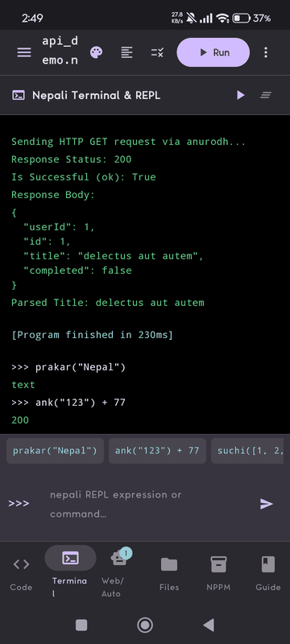
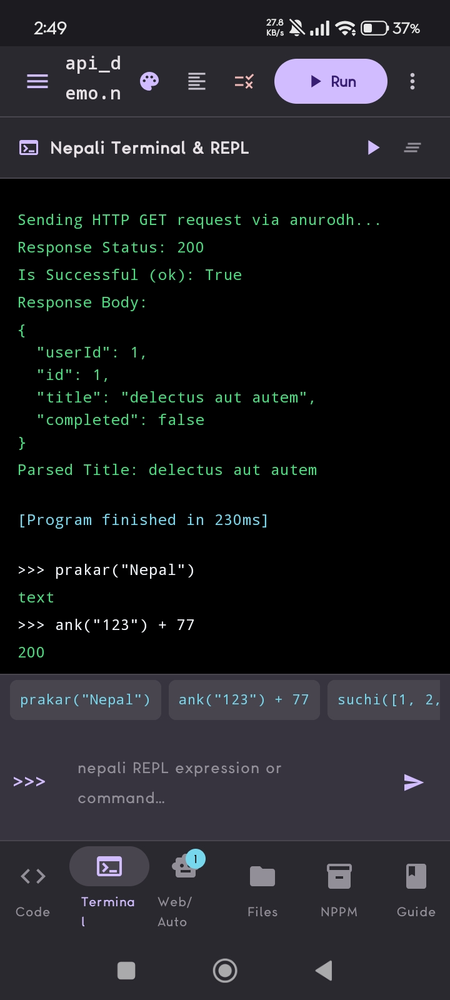
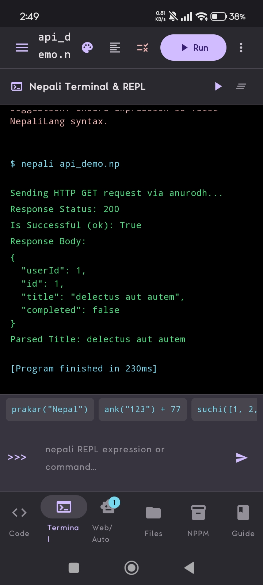
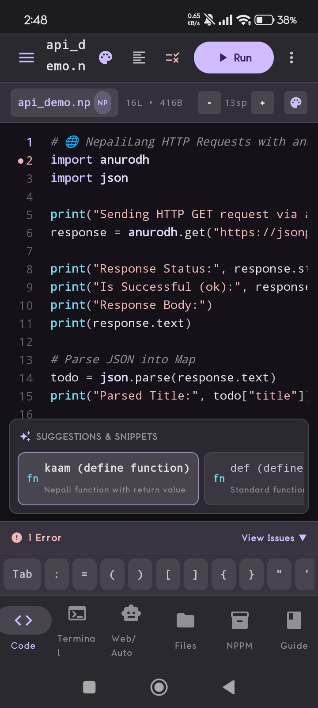
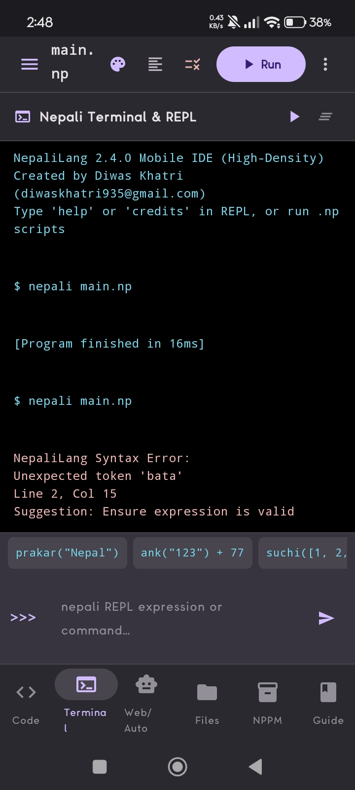
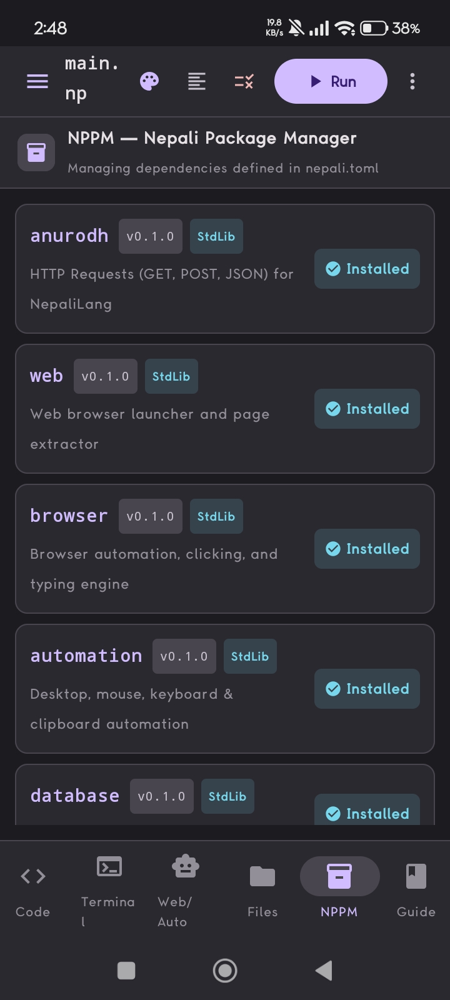

<p align="center">
  
</p>

<h1 align="center">🇳🇵 NepaliCode</h1>

<p align="center">
  <strong>A Nepali-first programming language and mobile developer workspace.</strong><br />
  Learn, write, run, debug, and explore NepaliCode programs from a focused Android IDE.
</p>

<p align="center">
  <a href="https://github.com/NepaliSource/NepaliCode/releases"></a>
  <a href="https://github.com/NepaliSource/NepaliCode/actions"></a>
  <a href="https://github.com/NepaliSource/NepaliCode/blob/main/LICENSE"></a>
  <a href="https://github.com/NepaliSource/NepaliCode/stargazers"></a>
</p>

<p align="center">
  
</p>

> **NepaliCode** is an open-source project led by **Diwas Khatri** and the NepaliSource community. It combines a Nepali-inspired language, an evolving runtime, and a modern Android coding environment designed for learners, makers, and contributors.

## ✨ Why NepaliCode?

Programming should feel approachable in the language people think in. NepaliCode keeps familiar programming ideas while introducing a clean, Nepali-inspired syntax layer. The long-term goal is not a keyword-only translation of another language; it is a genuine language and developer ecosystem with its own runtime, tools, documentation, and learning experience.[1]

The current Android application brings that idea to a mobile-first workflow: edit `.np` files, run programs in a terminal-style REPL, inspect diagnostics, browse files, explore packages, and learn through examples without leaving the app.

## 🚀 Highlights

| Area | What NepaliCode brings |
|---|---|
| **Nepali-first language** | Readable keywords such as `yedi`, `natra`, `kaam`, `firta`, `lyau`, and `ko_lagi`, alongside familiar programming concepts. |
| **Mobile IDE** | Kotlin + Jetpack Compose interface with editor, project files, terminal/REPL, guide, package manager, and web/automation surfaces. |
| **Language engine** | Lexer, parser, AST, interpreter, runtime values, environment handling, linting, tokenization, highlighting, and completion foundations. |
| **Developer workflow** | Project scripts, file operations, syntax-aware editing, diagnostics, themes, and a focused dark developer UI. |
| **Growing ecosystem** | Planned CLI, NPPM package manager, HTTP/API tools, browser automation, database APIs, formatter, linter, debugger, LSP, and NepaliCode Studio. |
| **Learning by doing** | Small examples, visible runtime output, helpful errors, and a language design that welcomes experimentation. |

## 📱 Mobile IDE showcase

The repository now includes the supplied mobile screenshots as versioned local assets, so the README remains stable even if external image hosting changes. The animated preview above cycles through the same screens in a compact GIF.

### 1. Terminal and HTTP response

The terminal view shows a NepaliCode program making an HTTP request, printing a successful response, parsing a title, and returning to the REPL for the next expression.

<p align="center">
  
</p>

### 2. API demo workflow

The API demo runs `nepali api_demo.np`, reports an HTTP 200 response, prints the response body, and exposes the parsed result directly inside the mobile terminal.

<p align="center">
  
</p>

### 3. Editor and REPL workspace

The editor workspace keeps source code, the Nepali Terminal & REPL, suggestion chips, and the bottom navigation in one compact flow for mobile development.

<p align="center">
  
</p>

### 4. Diagnostics that teach

The mobile IDE surfaces syntax errors close to the failing program and pairs them with a direct suggestion, helping beginners understand what to fix instead of hiding the failure behind a generic crash.

<p align="center">
  
</p>

### 5. NPPM package manager

The NPPM screen presents NepaliCode packages such as `anurodh`, `web`, `browser`, `automation`, and `database` with version and installation state visible at a glance.

<p align="center">
  
</p>

## 🧪 Language examples

A small program is intentionally familiar:

```nepalicode
a = 3
b = 4

c = a + b

print(c)
```

```text
7
```

Nepali-inspired control flow stays readable while preserving a conventional block structure:

```nepalicode
yedi age >= 18:
    print("Adult")
natra:
    print("Minor")
```

Functions and loops use the same approachable vocabulary:

```nepalicode
kaam jod(a, b):
    firta a + b

print(jod(10, 20))

ko_lagi i ma range(1, 6):
    print(i)
```

## 🇳🇵 नेपाली Quick Start Tutorial

यो छोटो tutorial ले NepaliCode मा पहिलो `.np` program कसरी बनाउने, चलाउने, र विस्तार गर्ने भनेर देखाउँछ। NepaliCode अहिले alpha चरणमा भएकाले केही command र module हरू experimental वा planned हुन सक्छन्।[1]

### १. Project तयार गर्नुहोस्

पहिले NepaliCode project को folder बनाउनुहोस् र एउटा `main.np` file सिर्जना गर्नुहोस्:

```bash
mkdir mero-project
cd mero-project
touch main.np
```

यदि package workflow प्रयोग गर्न चाहनुहुन्छ भने NPPM बाट project सुरु गर्न सक्नुहुन्छ:

```bash
nppm init
```

### २. पहिलो program लेख्नुहोस्

`main.np` मा तलको code राख्नुहोस्। `print()` ले terminal मा message देखाउँछ।

```nepalicode
naam = "नेपाल"
print("नमस्ते", naam)
```

### ३. Program चलाउनुहोस्

Project folder बाट `.np` file चलाउनुहोस्:

```bash
nepali run main.np
```

अपेक्षित output:

```text
नमस्ते नेपाल
```

Interactive प्रयोगका लागि REPL खोल्न सकिन्छ:

```bash
nepali repl
```

### ४. Variable र गणना प्रयोग गर्नुहोस्

NepaliCode मा variable assignment सरल छ। `ganit` जस्तो standard-library module प्रयोग गर्ने direction पनि project notes मा प्रस्तावित छ।

```nepalicode
pahilo = 12
dosro = 8
jamma = pahilo + dosro

print("जम्मा:", jamma)
```

### ५. निर्णय र loop लेख्नुहोस्

`yedi` को अर्थ `if`, `natra` को अर्थ `else`, र `ko_lagi` को अर्थ `for` हो।

```nepalicode
umera = 20

yedi umera >= 18:
    print("तपाईं वयस्क हुनुहुन्छ")
natra:
    print("तपाईं अझै नाबालिग हुनुहुन्छ")

ko_lagi sankhya ma range(1, 4):
    print("गन्ती:", sankhya)
```

### ६. Function बनाएर code पुनः प्रयोग गर्नुहोस्

Function बनाउन `kaam` र value फर्काउन `firta` प्रयोग गर्नुहोस्:

```nepalicode
kaam swagat(naam):
    firta "नमस्ते " + naam

sandesh = swagat("साथी")
print(sandesh)
```

### ७. अर्को चरण

अब तपाईंले `lyau` बाट module import गर्न, `koshish`/`samau` बाट error handle गर्न, `file` बाट notes save गर्न, र `anurodh` बाट HTTP request प्रयोग गर्न सक्नुहुन्छ। Project मा भएका advanced examples हेर्नुहोस्, अनि आफ्नो syntax example, test, वा documentation contribution का रूपमा पठाउनुहोस्।

> **ध्यान दिनुहोस्:** यो tutorial को भाषा र code examples NepaliCode को supplied design notes मा आधारित छन्। Runtime मा उपलब्ध command वा module फरक हुन सक्छ, त्यसैले प्रयोग गर्दा project को current implementation र release notes पनि जाँच गर्नुहोस्.[1]

### 🔥 Advanced `.np` examples

The following examples show the intended direction of NepaliCode beyond basic expressions. They are useful as language-design references and learning examples; module APIs may remain experimental or planned while the runtime is still in alpha.[1]

#### HTTP and JSON-style API work with `anurodh`

```nepalicode
lyau anurodh

kaam fetch_title(url):
    koshish:
        res = anurodh.get(url)
        yedi res.status == 200:
            firta res.text
        natra:
            print("Request failed:", res.status)
            firta khali
    samau error:
        print("Network error:", error)
        firta khali
    antya:
        print("Request complete")

body = fetch_title("https://example.com")
print(body)
```

#### File operations and reusable functions

```nepalicode
lyau file

kaam save_note(path, message):
    file.write(path, message)
    print("Saved:", path)

kaam read_note(path):
    yedi file.exists(path):
        firta file.read(path)
    firta "No note found"

save_note("notes.txt", "Namaste Nepal")
print(read_note("notes.txt"))
```

#### Browser automation workflow

```nepalicode
lyau browser

page = browser.khol("https://example.com")
page.click("Login")
page.type("email", "demo@example.com")
page.click("Submit")
page.wait(2)
page.screenshot("login-result.png")
page.close()
```

Browser automation is intended for authorized development, QA, testing, and personal workflows. Always respect the target service's terms and permissions.

#### Database access

```nepalicode
lyau database

db = database.open("app.db")
rows = db.query("SELECT * FROM users")

ko_lagi user ma rows:
    print(user)

db.close()
```

#### Nepali-style error handling and conditions

```nepalicode
koshish:
    age = 21
    yedi age >= 18 ra age < 60:
        print("Working age")
    athawa age >= 60:
        print("Senior citizen")
    natra:
        print("Underage")
samau error:
    print("Could not evaluate age:", error)
antya:
    print("Finished")
```

#### A small package workflow

```bash
nppm init
nppm install anurodh
nppm list
nepali run main.np
nepali test
nepali lint
nepali format
```

A project can declare its metadata in `nepali.toml`:

```toml
[project]
name = "myapp"
version = "0.1.0"
language = "nepalicode"

[dependencies]
```

> **Status note:** NepaliCode is in an early/alpha stage. Examples and APIs in the design notes may be implemented, experimental, or planned; they should not be read as a promise that every module is available in the current build.[1]

## 🇳🇵 Nepali-inspired syntax

| NepaliCode | Familiar equivalent |
|---|---|
| `yedi` | `if` |
| `natra` | `else` |
| `athawa` | `elif` |
| `jabasamma` | `while` |
| `ko_lagi` / `ma` | `for` / `in` |
| `kaam` / `firta` | `def` / `return` |
| `kakshya` | `class` |
| `lyau` / `bata` | `import` / `from` |
| `koshish` / `samau` / `antya` | `try` / `except` / `finally` |
| `ra` / `wa` / `hoina` | `and` / `or` / `not` |
| `sacho` / `jhut` / `khali` | `True` / `False` / `None` |
| `rok` / `agadi` | `break` / `continue` |

English-style syntax may remain available where appropriate, so developers can learn gradually without being forced into a single style.[1]

## 🌐 Ecosystem direction

The project is being developed in layers. The language core comes first, followed by runtime capabilities, standard-library modules, developer tooling, mobile workflows, and a broader ecosystem.[1]

```text
NepaliCode source
        │
        ▼
      Lexer ──► Parser ──► AST
                              │
             ┌────────────────┼────────────────┐
             ▼                ▼                ▼
         Runtime          Formatter            LSP
             │                │                │
             ▼                ▼                ▼
       Standard library   Editor tools    Completion & actions
             │
             ▼
     CLI · NPPM · Studio · Android
```

The planned standard-library direction includes `ganit`, `samaya`, `json`, `file`, `folder`, `anurodh`, `web`, `browser`, `automation`, `database`, `network`, and other practical modules. For example, the `anurodh` HTTP/API interface is designed around familiar operations such as `get`, `post`, `put`, `patch`, `delete`, `download`, and `upload`.[1]

## 🛠️ Technology stack

NepaliCode is an Android Studio project built with **Kotlin**, **Jetpack Compose**, **Material 3**, **AndroidX**, and **Gradle Kotlin DSL**. The UI and language engine are separated so that Android presentation work can evolve independently from language tooling.

```text
app/src/main/java/com/nepalicode/dev/
├── nepalicode/data          Project and file data models
├── nepalicode/editor        Themes, tokenizer, highlighter, completion, editor tools
├── nepalicode/ui            Main screens and ViewModel-driven app flows
├── nepalicode/ui/components Reusable Compose dialogs and UI components
├── nepalilang/core          Lexer, parser, AST, interpreter, linter, runtime values
└── ui/theme                  Compose colors, typography, and application theme
```

## 📦 Getting started

### Requirements

Install Android Studio with Android SDK Platform 36, Android Build Tools 36, and a Java 21-compatible development environment. AI-powered features may require a local Gemini API key; keep secrets in `.env` and never commit credentials.

### Clone and configure

```bash
git clone https://github.com/NepaliSource/NepaliCode.git
cd NepaliCode
cp .env.example .env
# Add local values only when an optional AI feature needs them.
```

### Build and test

```bash
./gradlew assembleDebug
./gradlew assembleRelease
./gradlew test
```

The debug APK is written to `app/build/outputs/apk/debug/app-debug.apk`. For production releases, use your own protected signing key and pass signing values through environment variables.

## 🗺️ Roadmap

| Horizon | Focus |
|---|---|
| **Now** | Stabilize the mobile editor, language runtime, project files, themes, diagnostics, and educational examples. |
| **Next** | Improve completion quality, expand standard-library capabilities, strengthen tests, and refine the terminal and package workflows. |
| **Later** | Grow the CLI, NPPM registry, formatter, linter, debugger, language server, desktop Studio, project sharing, and release channels. |

## 🤝 Contributing

Contributions are welcome across language design, compiler/runtime correctness, Compose UI, accessibility, Android performance, tests, examples, documentation, translations, and developer tooling. Start with [CONTRIBUTING.md](CONTRIBUTING.md), review the [Code of Conduct](CODE_OF_CONDUCT.md), and open an issue before large architectural changes.

Focused pull requests are easier to review. A useful language change normally includes a small example, parser coverage, interpreter behavior, diagnostics, and documentation for learners.

## 👨‍💻 Maintainers and links

NepaliCode is maintained by **Diwas Khatri** and the NepaliSource community.

| Resource | Link |
|---|---|
| Lead developer | [@diwaskhatri07](https://github.com/diwaskhatri07) |
| Organization | [NepaliSource](https://github.com/NepaliSource) |
| Repository | [NepaliSource/NepaliCode](https://github.com/NepaliSource/NepaliCode) |
| Releases | [GitHub Releases](https://github.com/NepaliSource/NepaliCode/releases) |
| License | [MIT License](LICENSE) |

## 🔖 Project tags

`nepalicode` · `nepali-programming-language` · `android-ide` · `kotlin` · `jetpack-compose` · `material3` · `compiler` · `interpreter` · `repl` · `developer-tools` · `education` · `open-source` · `nepali-tech`

## References

[1]: https://justpaste.it/h7x3y "NepaliCode project notes supplied by the maintainers"
[2]: https://ibb.co/Y4tt7RfM "NepaliCode terminal and HTTP screenshot"
[3]: https://ibb.co/jvBrVM6F "NepaliCode API demo screenshot"
[4]: https://ibb.co/XkrVJSW5 "NepaliCode editor screenshot"
[5]: https://ibb.co/7Htb6Tz "NepaliCode diagnostics screenshot"
[6]: https://ibb.co/VprTJCnH "NepaliCode NPPM screenshot"

<p align="center">
  
</p>

<p align="center"><sub>Built with Kotlin, Compose, curiosity, and a commitment to Nepali-first developer tools.</sub></p>
